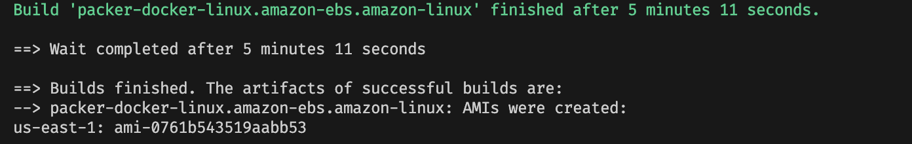
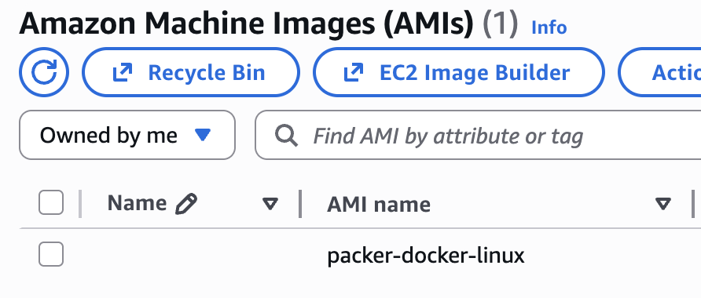
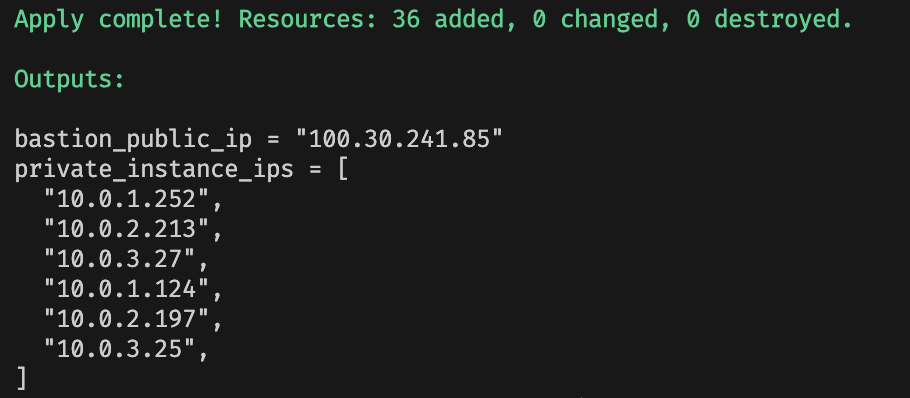
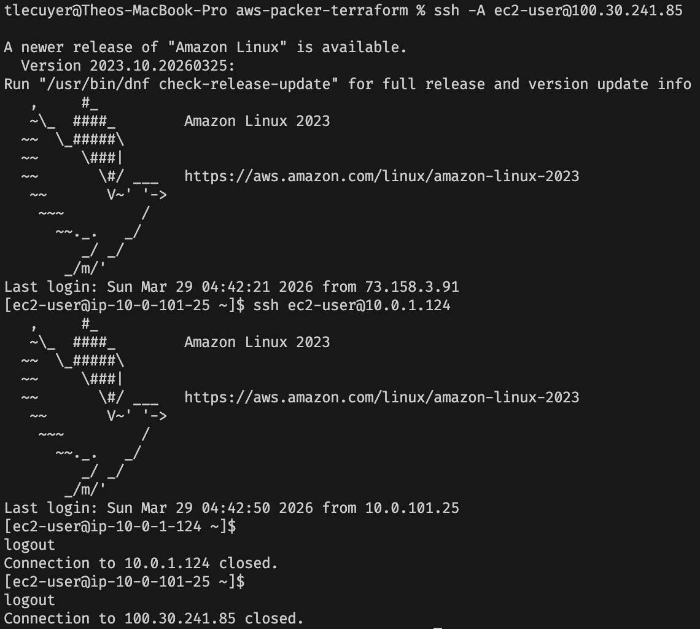
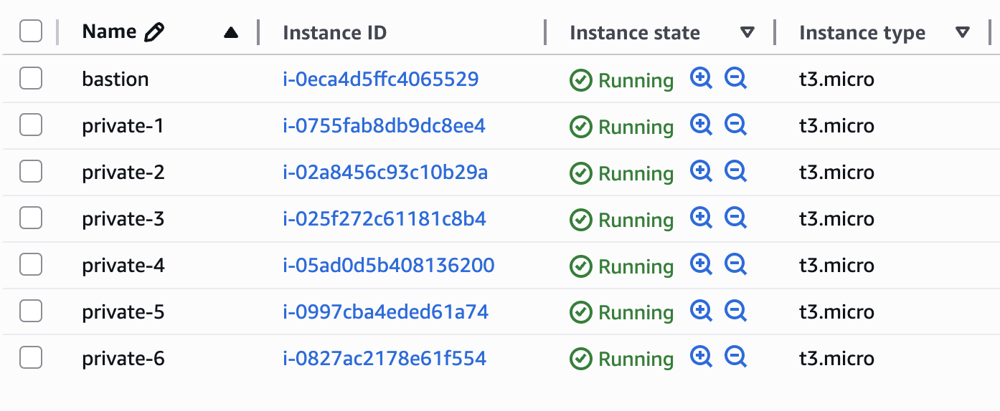
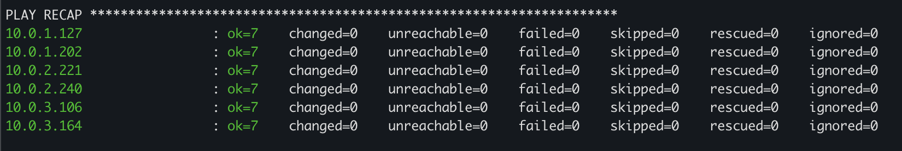
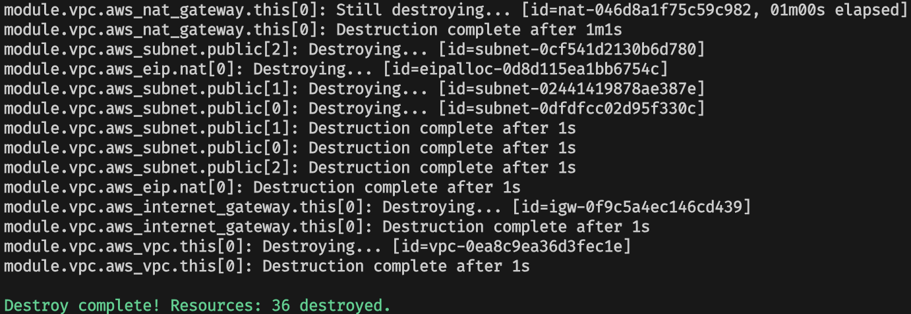

# aws-packer-terraform

IAC project using Packer, Terraform, and Ansible to build custom AWS AMIs, provision infrastructure, and configure EC2 instances automatically.

## Table of Contents

1. [Prerequisites](#prerequisites)
2. [Building the AMIs with Packer](#part-1-building-the-amis-with-packer)
3. [Provisioning Infrastructure with Terraform](#part-2-provisioning-infrastructure-with-terraform)
4. [Running the Ansible Playbook](#part-3-running-the-ansible-playbook)

> **Note:** Follow the sections in order to run this project successfully.

## Prerequisites

- [Packer](https://developer.hashicorp.com/packer/install) installed
- [Terraform](https://developer.hashicorp.com/terraform/install) installed
- AWS CLI configured with valid credentials
- An SSH key pair (see below)

### Generating an SSH Key

```bash
ssh-keygen -t rsa -C "your_email@example.com" -f ~/.ssh/tf-packer
```

## Part 1: Building the AMIs with Packer

Two AMIs are required — one Amazon Linux and one Ubuntu. Both include Docker enabled on boot and the `tf-packer` SSH public key baked in.

> **Note:** Update the public key path in each `.pkr.hcl` file to match the location of your `tf-packer.pub` key.

```bash
cd packer/
packer init .
packer build aws-amazonlinux.pkr.hcl
packer build aws-ubuntu.pkr.hcl
```

Each build will output a new AMI ID — save both for the next step.





## Part 2: Provisioning Infrastructure with Terraform

### What gets created

- VPC with public and private subnets across 3 availability zones
- NAT gateway for outbound internet access from private subnets
- Bastion host in the public subnet (SSH restricted to your IP)
- 3 Amazon Linux EC2 instances in private subnets (tagged `OS: amazon`)
- 3 Ubuntu EC2 instances in private subnets (tagged `OS: ubuntu`)
- 1 Ansible controller EC2 instance in a private subnet

### Setup

Create a `terraform/terraform.tfvars` file with your values:

```hcl
linux_ami_id  = "ami-xxxxxxxxxxxxxxxxx"  # AMI ID from Amazon Linux Packer build
ubuntu_ami_id = "ami-xxxxxxxxxxxxxxxxx"  # AMI ID from Ubuntu Packer build
my_ip         = "x.x.x.x/32"            # Your public IP
```

### How to run

```bash
cd terraform/
terraform init
terraform plan
terraform apply
```

### Output

After apply, Terraform outputs the bastion public IP, all private instance IPs, and the Ansible controller IP.



### Connecting to instances

```bash
ssh -A -i ~/.ssh/tf-packer ec2-user@<bastion_public_ip>
```

From the bastion, jump to any private instance:

```bash
# Amazon Linux instances
ssh ec2-user@<private_instance_ip>

# Ubuntu instances
ssh ubuntu@<private_instance_ip>
```



**Network behavior:**

- SSH to the bastion is only allowed from your IP
- SSH to private instances is only allowed from the bastion or other private instances
- Private instances can reach the internet outbound via the NAT gateway

### AWS Console



## Part 3: Running the Ansible Playbook

The Ansible controller is configured on first boot via `user_data`. It installs Ansible, writes the `inventory.ini` and `playbook.yml`, and runs the playbook on all 6 instances.

### SSH to the Ansible controller

From the bastion, jump to the controller:

```bash
ssh ubuntu@<ansible_controller_ip>
```

### Run the playbook

```bash
sudo ansible-playbook -i /home/ubuntu/inventory.ini /home/ubuntu/playbook.yml
```

### What the playbook does

Runs on all 6 EC2 instances in two separate workflows. Amazon Linux first, then Ubuntu:

1. **Updates and upgrades all packages**
2. **Verifies Docker is at the latest version**
3. **Reports disk usage for each instance**

### Expected output

You should see each task complete with `ok` or `changed` for all 6 hosts, with Docker versions and disk usage printed per instance. The final play recap should look something like this showing `failed=0` and `unreachable=0` for all hosts.



### Teardown

```bash
terraform destroy
```


