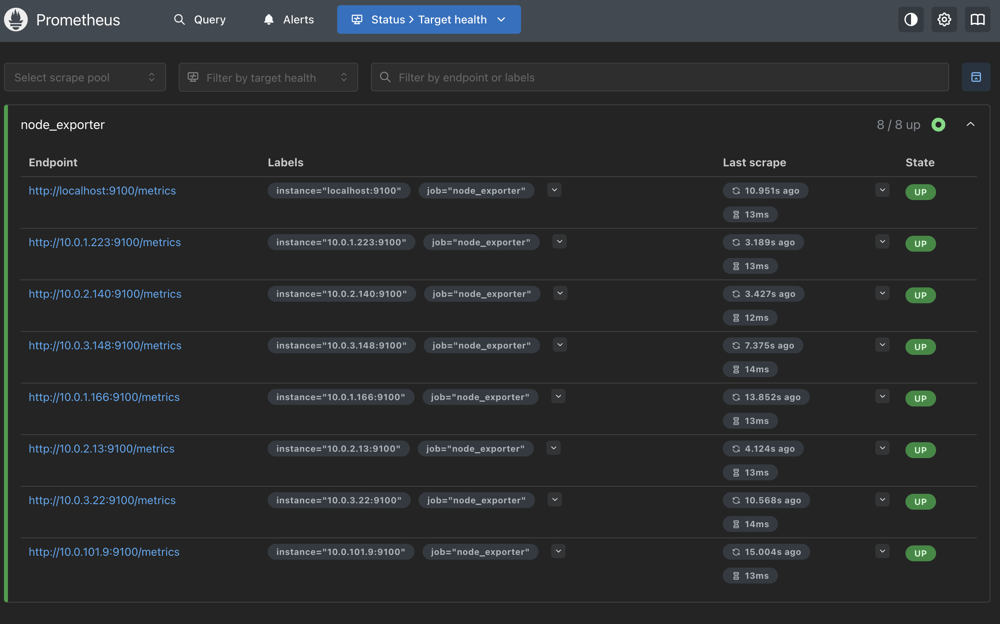
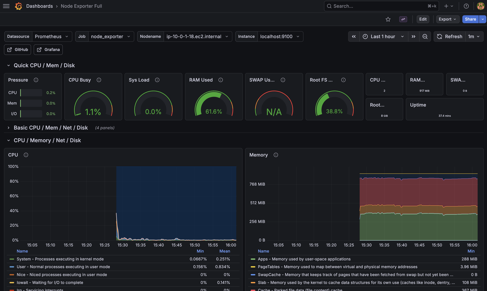

# aws-packer-terraform

IAC project using Packer and Terraform to build a custom AWS AMI and provision a VPC, subnets, bastion host, and private EC2 instances with full infrastructure monitoring via Prometheus and Grafana.

## Table of Contents

1. [Prerequisites](#prerequisites)
2. [Building the AMI with Packer](#part-1-building-the-ami-with-packer)
3. [Provisioning Infrastructure with Terraform](#part-2-provisioning-infrastructure-with-terraform)
4. [Monitoring with Prometheus and Grafana](#part-3-monitoring-with-prometheus-and-grafana)

> **Note:** Follow the sections in order to run this project successfully.

## Prerequisites

- [Packer](https://developer.hashicorp.com/packer/install) installed
- [Terraform](https://developer.hashicorp.com/terraform/install) installed
- AWS CLI configured with valid credentials
- An SSH key pair (see below)

### Generating an SSH Key

```bash
ssh-keygen -t rsa -C "your_email@example.com" -f ~/.ssh/tf-packer
```

## Part 1: Building the AMI with Packer

### What the AMI includes

- Amazon Linux 2023
- Docker (enabled on boot)
- SSH public key baked in for key-based access

### How to build

#### Note, insert the location of your tf-packer.pub key on your machine in the source provisioner of `aws-amazonlinux.pkr.hcl`

```bash
cd packer/
packer init .
packer build aws-amazonlinux.pkr.hcl
```

### Upon running the build command, you should see the build status complete and return your new private ami id.


### Verify in the AWS Console that you have successfully created the image


## Part 2: Provisioning Infrastructure with Terraform

### What gets created

- VPC with public and private subnets across 3 availability zones
- NAT gateway so private instances can reach the internet outbound
- Bastion host in the public subnet (SSH restricted to your IP)
- 6 EC2 instances in the private subnets using the Packer AMI from Part 1

### Setup

Create a `terraform/terraform.tfvars` file with your values:

```hcl
ami_id                 = "ami-xxxxxxxxxxxxxxxxx"  # AMI ID from Part 1
my_ip                  = "x.x.x.x/32"            # Your public IP
grafana_admin_password = "yourpassword"           # Grafana login password
```

### How to run

```bash
cd terraform/
terraform init
terraform plan
terraform apply
```

### Output

After apply, Terraform outputs the bastion public IP and all private instance IPs.


### Connecting to instances

Load your SSH key and connect to the bastion with agent forwarding:

```bash
ssh-add ~/.ssh/tf-packer
ssh -A ec2-user@<bastion_public_ip>
```

From the bastion, SSH into any private instance:

```bash
ssh ec2-user@<private_instance_ip>
```

The screenshots below show connecting to the bastion, hopping to a private instance, and exiting both.


**Expected behaviors:**

- SSH into the bastion is only allowed from your IP
- SSH into private instances is only allowed from the bastion
- Private instances cannot SSH into each other
- Private instances can reach the internet outbound via the NAT gateway

### AWS Console


### Teardown

```bash
terraform destroy
```


## Part 3: Monitoring with Prometheus and Grafana

### What gets created

- A monitoring EC2 instance in the private subnet running Prometheus and Grafana via Docker
- Prometheus scrapes node_exporter metrics (CPU, memory, disk) from all 8 EC2 instances every 15 seconds
- Grafana is pre-configured with Prometheus as a data source and the Node Exporter Full dashboard

### What the AMI includes (updated)

The Packer AMI now also includes:

- node_exporter installed and enabled as a systemd service on port 9100

This runs on every instance including the bastion, private instances, and the monitoring instance itself.

### Connecting to Prometheus and Grafana

Both services run in the private subnet with no public access. Access them via SSH tunnel from your local machine:

```bash
ssh-add ~/.ssh/tf-packer
ssh -A -J ec2-user@<bastion_public_ip> \
  -L 9090:<monitoring_instance_ip>:9090 \
  -L 3000:<monitoring_instance_ip>:3000 \
  ec2-user@<monitoring_instance_ip> -N
```

Then open in your browser:

- Prometheus: [http://localhost:9090](http://localhost:9090)
- Grafana: [http://localhost:3000](http://localhost:3000) (login: `admin` / your configured password)

### Verifying Prometheus targets

Navigate to [http://localhost:9090/targets](http://localhost:9090/targets) to confirm all 8 instances are being scraped and show as UP.



### Grafana Dashboard

The Node Exporter Full dashboard is automatically provisioned on startup. Navigate to Dashboards in the Grafana sidebar to view CPU and memory utilization per instance. Use the instance dropdown at the top to switch between all 8 EC2s.


